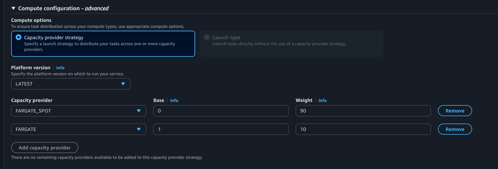

## Cost Efficient Fargate Policies using Capacity Providers and Fargate Spot

After starting up my fargate services and letting them run for a few days, I was notified by AWS about a new cost anomaly. It wasn't anything anomalous, just new, as my costs before were essentially zero. I wanted to find a way to reduce this cost as much as possible while still satisfying the class requirements for my pizza service, so I started exploring.

Using the AWS cost explorer, I could quickly see that my greatest cost was the fargate service itself, especially because, unlike some of the other services I was using, this one was billed by the hour. I didn’t just want to manually turn it on and off as my site was needed, and I also didn’t want to migrate everything over to a lambda function (even though that probably is the most practical for such an infrequently accessed service). I decided to research and find out what ways I could reduce my fargate costs without changing infrastructure.

I started out with simply reducing my memory and CPU allotment to half the size, which theoretically would cut the cost by half as well. Knowing the minimal requirements of the pizza service that I was running, I knew that this wouldn’t be an issue considering the lightweight requirements of my service and the low user-stresses placed upon it. Worst case, if I started experiencing load problems, I knew I could either increase the capacity again or even configure my load balancer and ECS to create more services as the load requirements increased.

The capacity resizing is not really what I wanted to report upon though, as really the interesting and new thing that I explored was ECS capacity providers. When it comes to ECS Fargate services, two options exist for a capacity provider.

The first is the standard Fargate. You purchase an allotment of server space/capacity and run your service on it. The second option is Fargate Spot. It functions identically to Fargate, but with one catch. You aren’t renting your own server capacity, you are borrowing the unused capacity sitting around on the AWS servers. This means that at any moment your server capacity will be taken away with only a 2-minute notice. The perk of Fargate Spot is that because you are only using borrowed, unused space, AWS offers this capacity provider at up to a 70% discount. See the [official AWS ECS Fargate documentation](https://docs.aws.amazon.com/AmazonECS/latest/developerguide/fargate-capacity-providers.html?icmpid=docs_ecs_hp_deploy) and the [Fargate Spot announcement blog post](https://aws.amazon.com/blogs/aws/aws-fargate-spot-now-generally-available/) to learn more about these two capacity providers.

Considering the nature of the pizza service backend, this opportunity for savings was perfect. For one, the service requires very little resources and so the chances of unused server capacity being available is high. Additionally, the lightweight and simplistic nature of the pizza service means that it can be torn down and restarted in under two minutes on a new server space once the termination notice is sent by Fargate Spot.

For a pure demonstration and learning project like the pizza service, Fargate Spot is wonderful. Although, in a real-world, critical system, I wondered how the benefits of Fargate Spot could be acquired without the risk of lack of unused server capacity availability. This is where weighted capacity providers come in.

When configuring a service definition, I discovered that you can define your service to use both the Fargate and Fargate Spot capacity provider. When defining these two providers, you are able to set a “base” number of tasks and a ‘weight’ property on each provider. For example, if I want AWS to use Fargate Spot in all situations possible and assuming only 1 task will be running at any time, but safely default back to Fargate when necessary, I can declare a weight of 99 on Spot and 1 on Fargate. This will cause 99% of the tasks to be launched on Spot, essentially guaranteeing that your service will use spot. In the case that a Fargate Spot capacity is not available, AWS then will default back to the Fargate capacity provider, ensuring that you always have your service running.

In an even larger-scale system, these “base” and “weighted” settings can be expanded even further. For example, let's say the pizza service always needs 10 instances of the task running. You want to save as much as possible on costs, but you also want to guarantee that your service will always be available, even if slow. With weighted capacity providers, you could define that a majority, say 90%, of your tasks are launched on Fargate Spot, with Fargate covering the other 10%. You can then also set the “base” number of Fargate tasks to be 1, guaranteeing that you will always have one reliable Fargate service running at all times, while reducing costs by placing most of your services on Spot.

---

In order to tweak your own capacity provider settings, simply update your ECS cluster’s service definition, the path to which can be seen in the following breadcrumbs:

Once you are in the “Update” menu for your service, find the “Compute configuration” settings and set up your capacity providers however you desire.

---

An intelligent use of capacity providers can drastically reduce your AWS ECS costs while ensuring reliability. As I have explored this cost-reduction option, I not only learned how to save money with AWS, but also how to work with some of the underlying technologies that AWS relies upon, such as these capacity providers.
